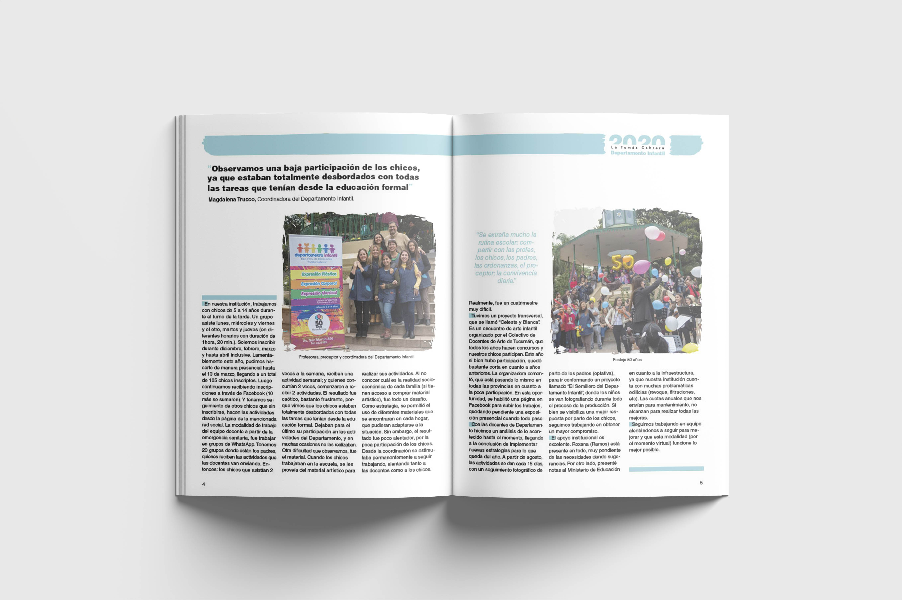
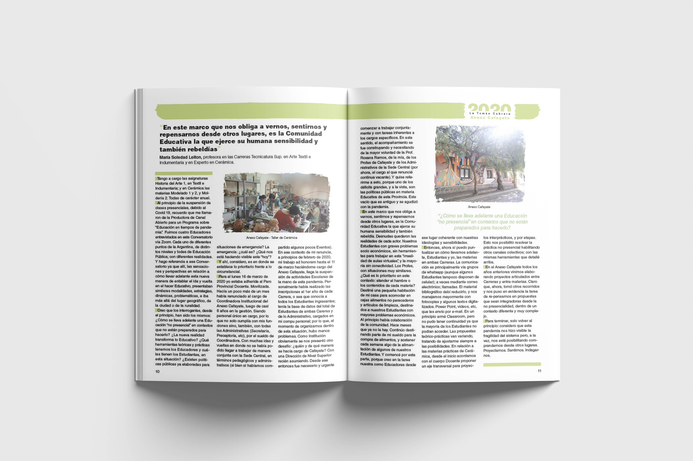

    
    
    



Durante mi tiempo estudiando en la Escuela de Bellas Artes tuve el honor de participar en el proceso creativo y gráfico para la edición 2020 de "La Tomás Cabrera", la publicación anual sin fines de lucro gestionada por la Cátedra de Taller de Diseño de Imagen III. Esta iniciativa forma parte del tercer año de la Tecnicatura Superior en Artes Visuales con Orientación al Diseño Gráfico. 

En esta segunda edición, mi labor se centró en dar vida a las historias y voces de nuestra comunidad artística. Este proyecto no solo fue un desafío creativo, sino también una oportunidad para contribuir al legado artístico y educativo de nuestra institución. 

Puede ver la [revista completa aquí](https://drive.google.com/file/d/1imKR-n9H9tvAHVrNKz9eHFvsdkA71BVr/view?usp=sharing).

