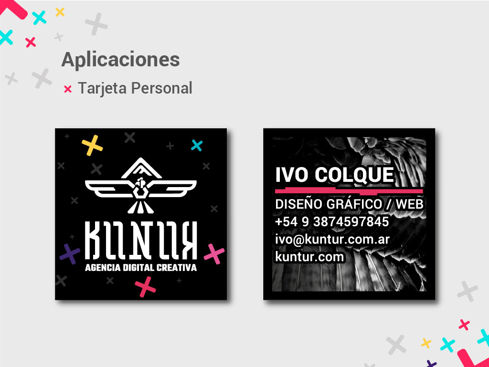
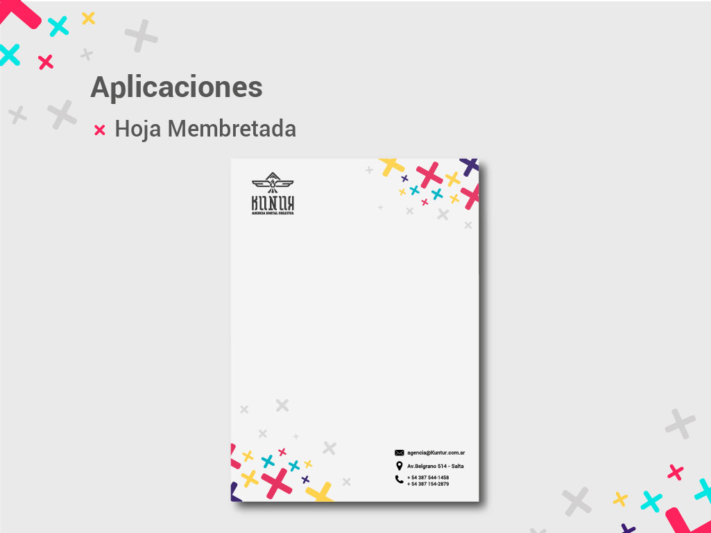
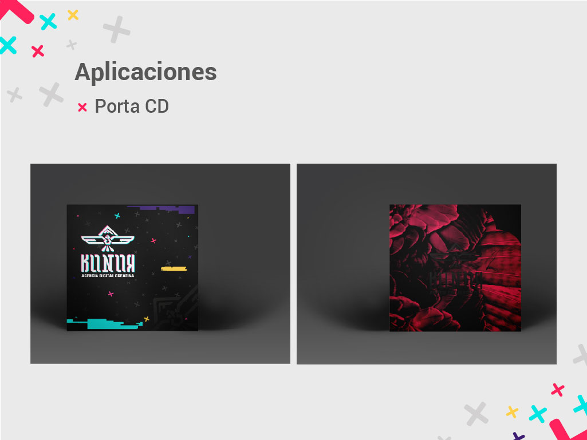
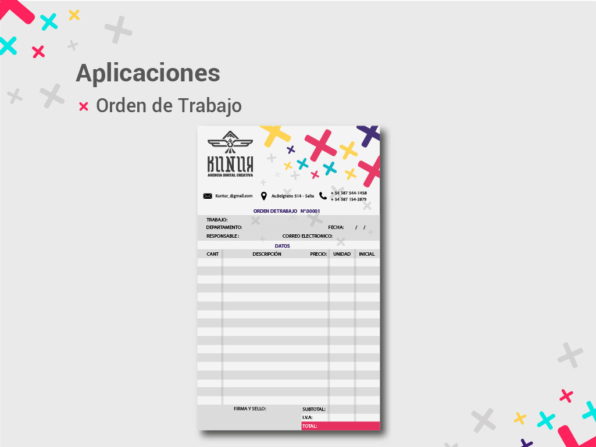
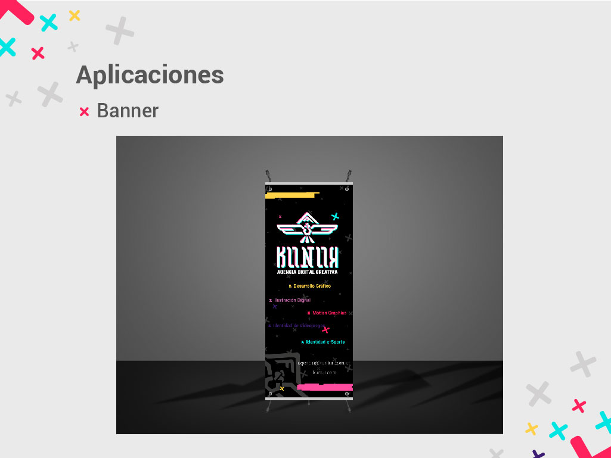

    
    
    



Fui parte de "Kuntur", una agencia formada por estudiantes del ultimo año de la carrera de diseño grafico, donde contribui al diseño de su identidad.

La creación de la identidad visual no se limitó al diseño del logotipo; se extendió a la formulación de pautas y principios coherentes. Como parte del equipo, contribui en el diseño de la identidad asi como la maquetacion del manual de identidad visual interno. Este documento detalla las decisiones de diseño, proporciona pautas para mantener la coherencia y preserva la autenticidad de nuestra marca en todas sus aplicaciones.

Puede ver la [manual completo aquí](https://drive.google.com/file/d/1ubL0_vg9hfRI1GLTRd_xKqPiQ4GR7rsN/view?usp=sharing).

