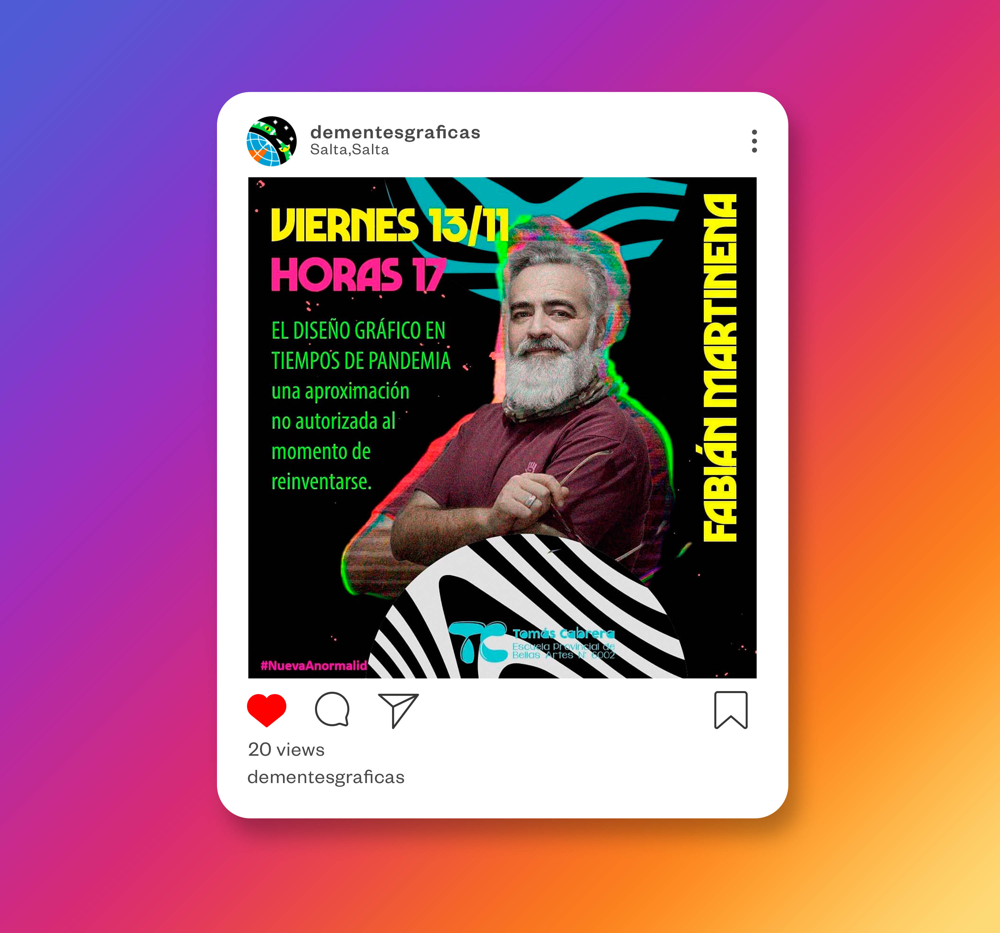
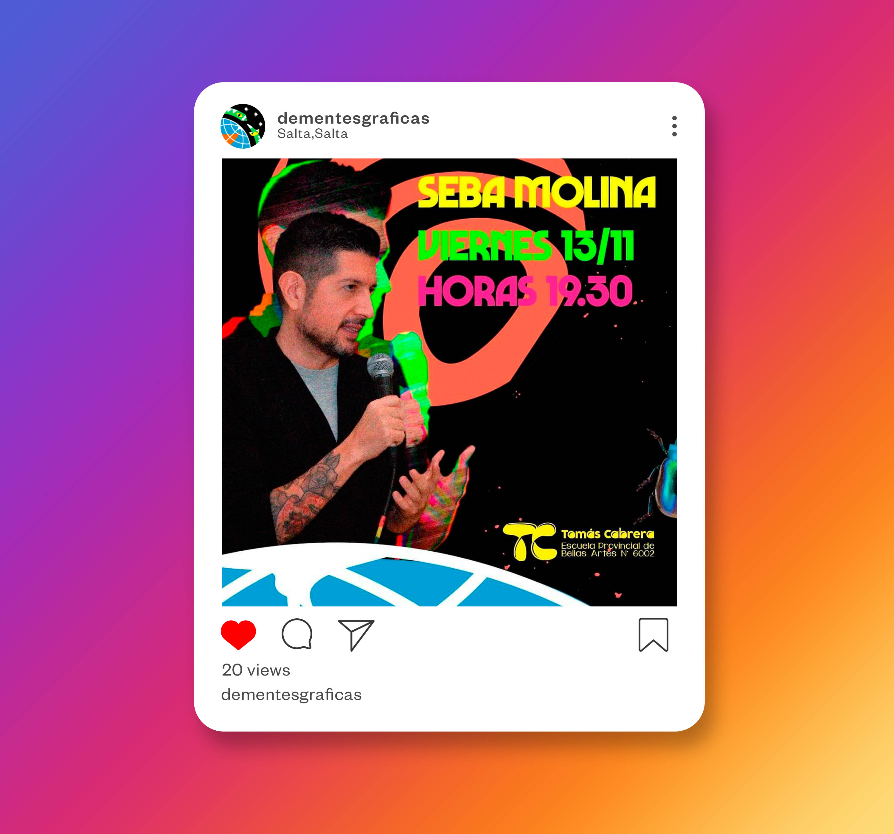
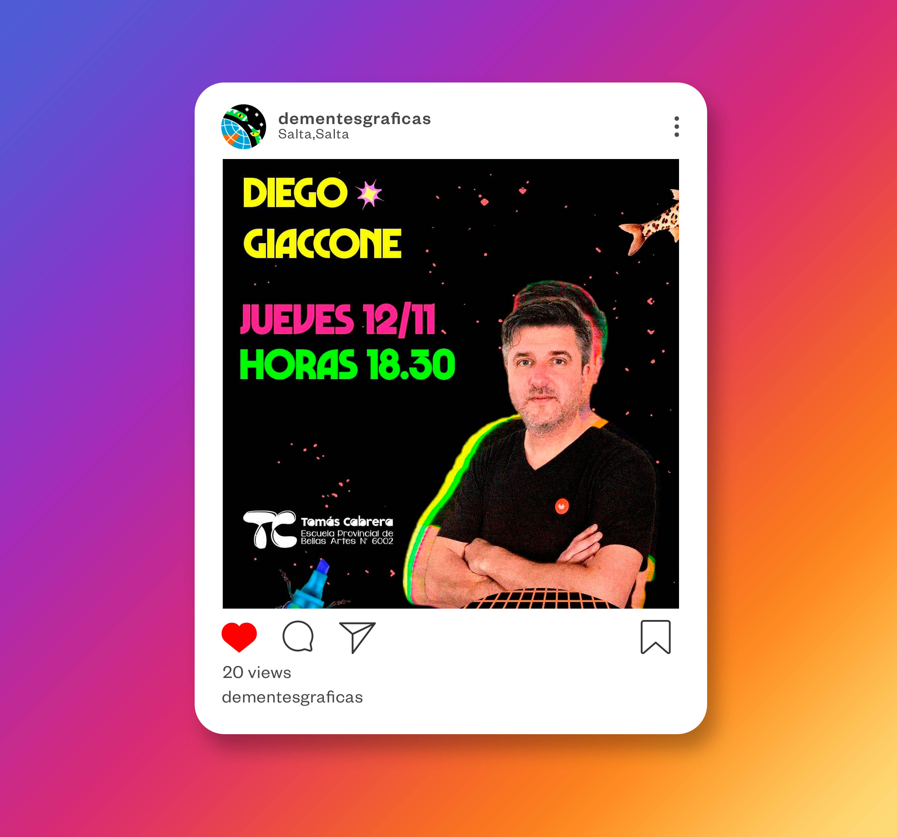

    
    



Tuve el honor de formar parte del equipo responsable de la creación de la identidad visual para la edición 2020 del evento "Dementes Gráficas", organizado por estudiantes del último año de la carrera de Diseño Gráfico de la Escuela Provincial de Bellas Artes “Tomas Cabrera”. Nuestra labor no solo implicó diseñar un conjunto de elementos visuales, sino también contribuir a la esencia y la experiencia global del evento.

Este año, la edición fue especial, enfrentándonos al desafío impuesto por la pandemia, lo que llevó a una transformación del evento a un formato virtual. Nuestro equipo no solo diseñó la identidad visual, sino también las piezas esenciales para la presencia en línea, destacando especialmente en las redes sociales

Puede ver mas sobre el evento en su [instagram](https://www.instagram.com/dementesgraficas/).

