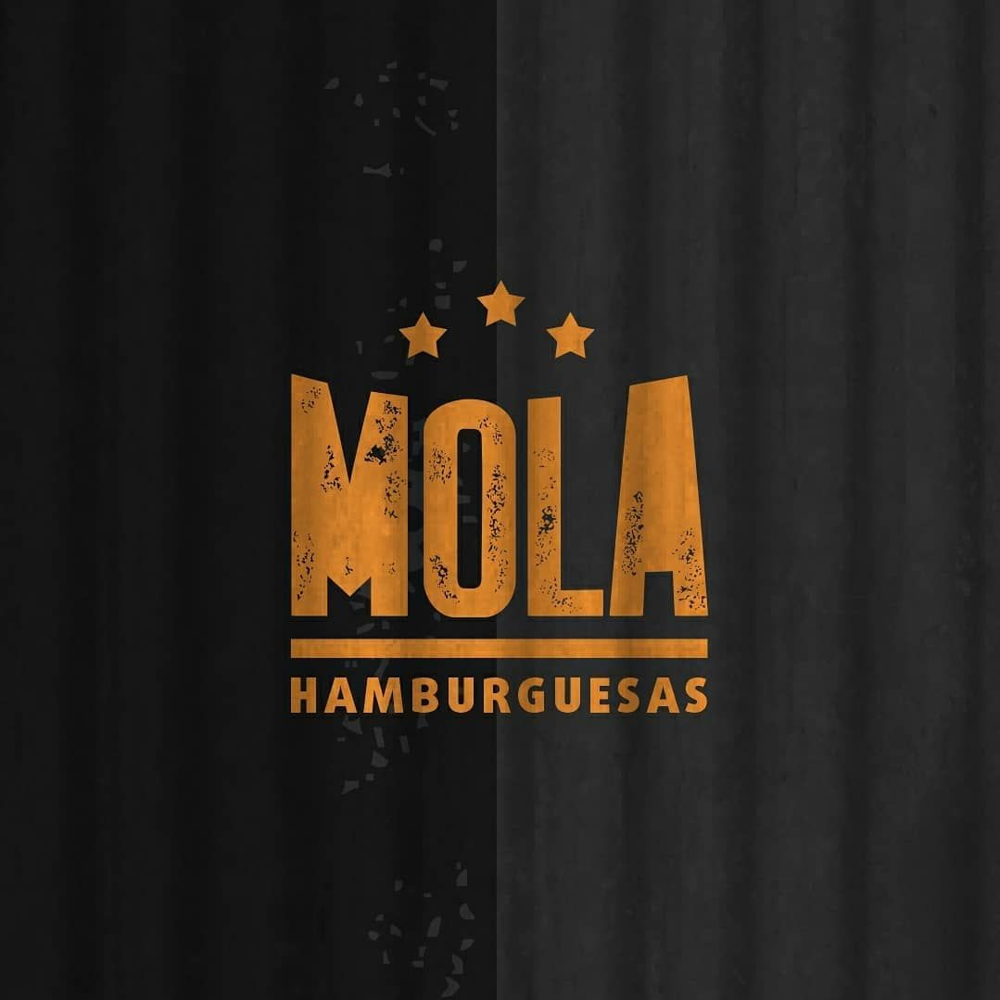
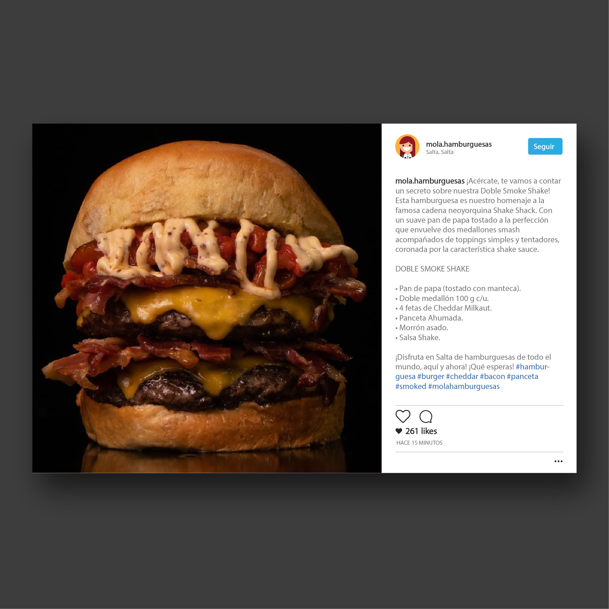
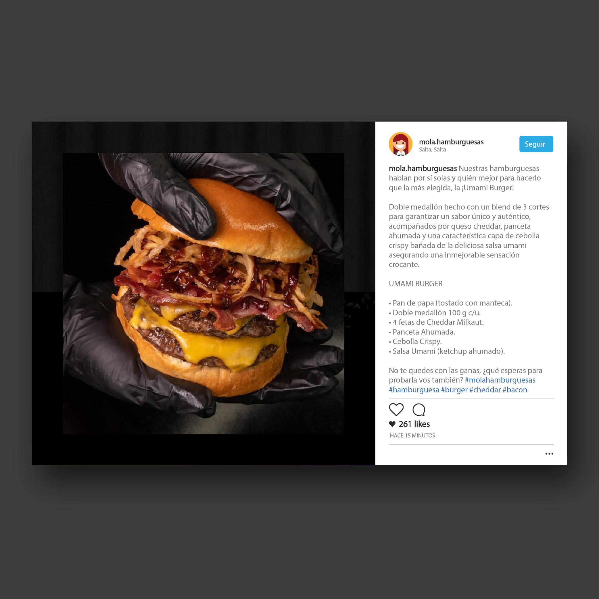
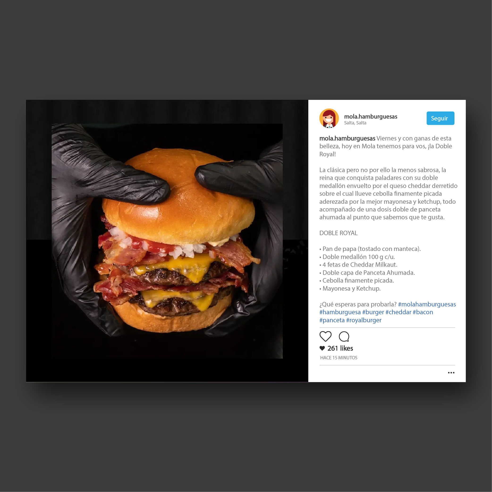
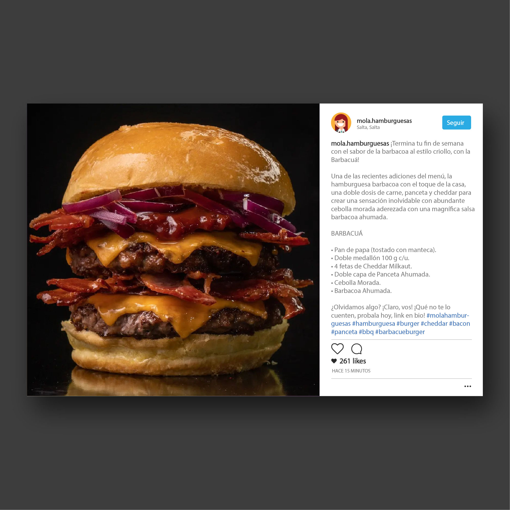
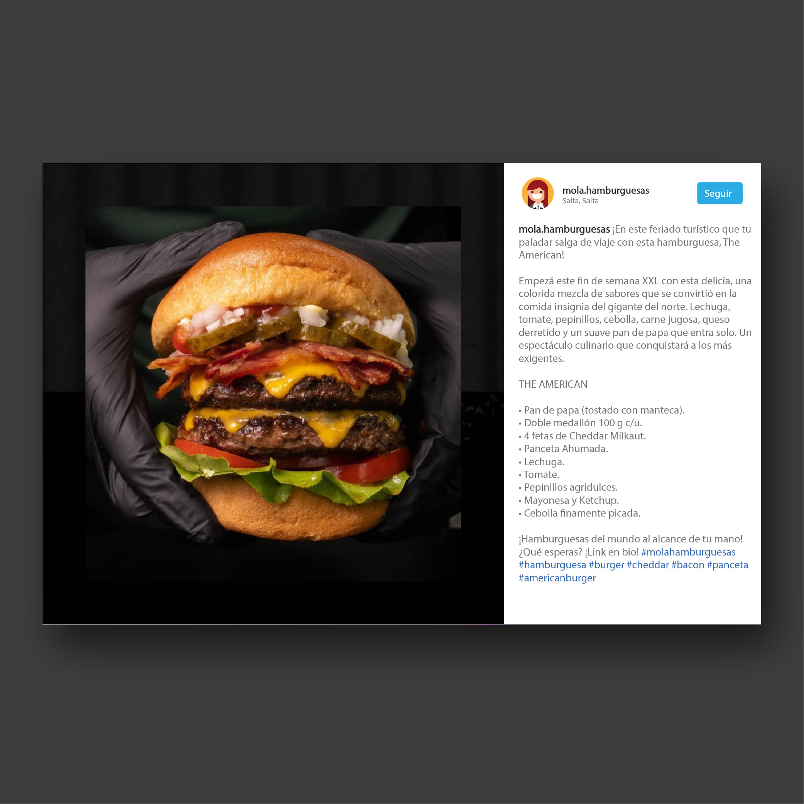

    
    

Tuve la oportunidad de colaborar en la campaña de redes sociales para Mola Hamburguesas, una hamburguesería local que buscaba destacarse con su eslogan: “Hamburguesas para exigentes”. Mi rol fue desarrollar el copywriting para sus publicaciones de Instagram, trabajando en conjunto con un compañero que se encargó de la parte gráfica.

El objetivo de la campaña era resaltar la calidad de los ingredientes gourmet de Mola, diferenciándose de la comida rápida tradicional. A través de un tono cercano y directo, creé textos que reflejaran el carácter exigente de la marca, reforzando la idea de que sus hamburguesas están hechas para quienes valoran la excelencia. Cada publicación subrayaba el uso de los mejores ingredientes, invitando a los seguidores a disfrutar de una experiencia gastronómica única, sin comprometer la rapidez en el servicio.

Puedes ver más sobre las publicaciones en el [Instagram](https://www.instagram.com/p/CTGSuK7Mdhc/?img_index=1) de Mola Hamburguesas.

